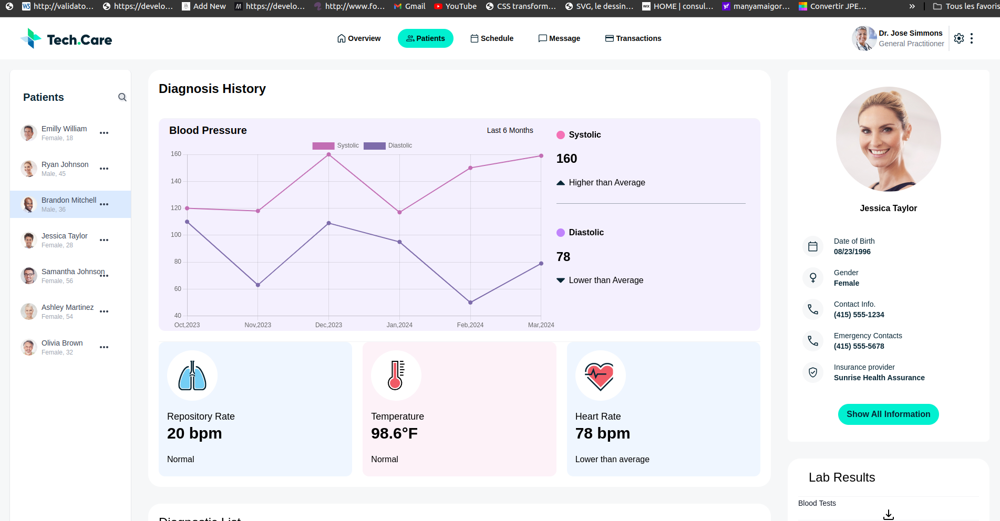
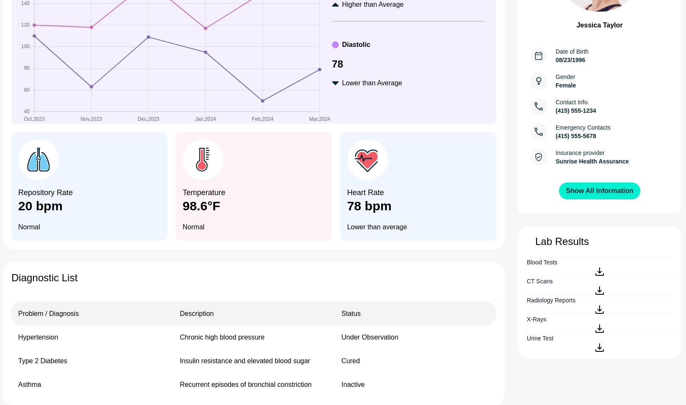

# Coalition Technologies test

the aim is to convert an Adobe XD template into HTML, and make an API call to update various parts of the user interface. this is the model
[model](https://xd.adobe.com/view/121254c9-532f-4772-a1ba-dfe529a96b39-4741/)

## Start
The project has been created with vite for react js; to start it, you need to install the dependencies and launch the development server.

```bash
cd coalition_technologies/
npm i
npm run dev
```

## Technical approach

- To create the project, I used the React library, to manage the various components. (I already felt more comfortable with it)
and chartjs to create the graph

- As for CSS, I decided to go with tailwind css. What's more, the model guidelines are very precise on the dimensions of profile circles and other icons. 

## Sources & Tools

* [Adobe XD template](https://xd.adobe.com/view/121254c9-532f-4772-a1ba-dfe529a96b39-4741/)
* [Chartjs](https://www.chartjs.org/docs/latest/samples/line/line.html)
* [Patient data API](https://documenter.getpostman.com/view/11861104/2sA35G42ve)

## Screenshot of the application

### First screen


### second screen
